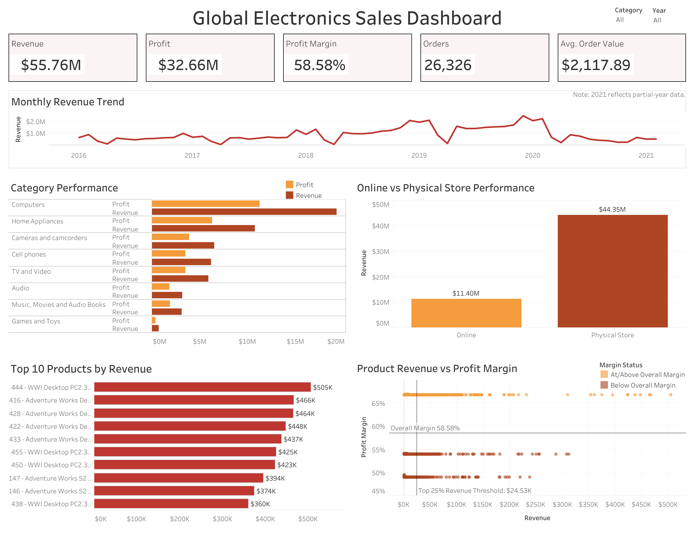

# Global Electronics Sales Analysis

An end-to-end data analysis project exploring sales, profitability, product performance, customer behavior, and sales channels for a global electronics retailer.

The project includes data cleaning with Python, SQL analysis in PostgreSQL, and an interactive Tableau dashboard designed to turn raw sales data into actionable business insights.

## 📊 Live Dashboard

[View the Interactive Tableau Dashboard](https://public.tableau.com/views/GlobalElectronicsSalesDashboard_17884941485620/GlobalElectronicsSalesDashboard)

## Dashboard Preview



## Business Problem & Objectives

The goal of this project is to analyze Global Electronics sales data and identify the main drivers of revenue, profit, customer behavior, and product performance.

The analysis focuses on answering key business questions such as:

- How much revenue and profit did the company generate?
- How did sales and profit change over time?
- Which categories, brands, and products performed best and worst?
- Which countries and stores generated the most revenue and profit?
- How did online sales compare with physical store sales?
- Which customer groups generated the most revenue?
- What was the average order value, and which customers placed the largest orders?
- How long did online orders take to deliver?
- Which high-revenue products had relatively low profitability?
- What business recommendations can be made from the analysis?

## Tools & Technologies

- **Python (Pandas)** — Cleaned, transformed, and validated the raw data before analysis
- **PostgreSQL / SQL** — Built the database, joined the tables, calculated key business metrics, and answered the main business questions
- **Tableau** — Built an interactive dashboard to show sales trends, product performance, profitability, and sales channel performance

## Data Preparation & Cleaning

Before starting the analysis, the raw datasets were reviewed and cleaned in Python using Pandas.

The main cleaning steps included:

- Standardized column names for easier analysis
- Converted date fields to datetime format
- Cleaned price and cost columns by removing currency symbols and commas
- Converted numeric fields to the correct data types
- Checked for missing values and duplicates
- Reviewed missing delivery dates and confirmed they were expected for physical store purchases
- Validated the cleaned datasets before loading them into PostgreSQL

## SQL Analysis

After cleaning the data, the datasets were loaded into PostgreSQL for analysis.

The SQL analysis covered:

- Overall business performance, including revenue, cost, profit, quantity sold, total orders, profit margin, and average order value
- Yearly and monthly sales trends, including revenue and profit growth over time
- Category, subcategory, brand, and product performance
- Country and store performance to understand where sales were strongest
- Online vs physical store performance across revenue, profit, orders, average order value, and profit margin
- Top customers, customer groups, and largest individual orders
- Customer performance by gender and age group
- Average order value across different customer segments
- Online delivery performance, including average, minimum, maximum, and median delivery time
- High-revenue products with below-average profit margins
- Business recommendations based on the findings

## Key Findings

- The company generated **$55.76M in revenue** and **$32.66M in profit**, with an overall profit margin of **58.58%**
- A total of **26,326 orders** were placed, with an average order value of **$2,117.89**
- **Computers** was the strongest product category, generating the highest revenue and profit
- Physical stores generated **$44.35M in revenue**, compared with **$11.40M from online sales**, while both channels maintained similar profit margins
- Customers aged **65+** generated the highest revenue among the age groups analyzed
- Online orders took about **5 days on average** to deliver, with some orders taking as long as **17 days**
- Several high-revenue products were identified with profit margins below the company average, highlighting opportunities to review pricing, costs, or product mix
- 2021 contains only partial-year data, so it was not treated as a complete year when reviewing the sales trend
  
## Business Recommendations

Based on the analysis, the main recommendations are:

- Continue prioritizing **Computers** and other high-performing categories that generate the most revenue and profit
- Review pricing, supplier costs, and product mix for high-revenue products that fall below the overall profit margin
- Look for ways to grow **online sales**, since online and physical stores have similar profit margins but online revenue is much lower
- Focus on retaining high-value customers and customers who place large orders
- Focus on retaining the **65+ customer group**, which generated the highest revenue among the age groups analyzed
- Review online orders with unusually long delivery times to identify possible fulfillment issues


## Project Structure

```text
global-electronics-sales-analysis/
│
├── data/
│   ├── raw/
│   │   ├── Customers.csv
│   │   ├── Data_Dictionary.csv
│   │   ├── Products.csv
│   │   ├── Sales.csv
│   │   └── Stores.csv
│   │
│   └── cleaned/
│       ├── customers_clean.csv
│       ├── products_clean.csv
│       ├── sales_clean.csv
│       └── stores_clean.csv
│
├── images/
│   └── dashboard_overview.png
│
├── notebooks/
│   └── 01_data_cleaning.ipynb
│
├── sql/
│   ├── 01_create_tables.sql
│   ├── 02_business_analysis.sql
│   └── 03_tableau_view.sql
│
├── tableau/
│   └── Global Electronics Sales Dashboard.twbx
│
└── README.md
```

## Data Source

The dataset used in this project is the **Global Electronics Retailer** dataset from [Maven Analytics](https://mavenanalytics.io/guided-projects/global-electronics-retailer).

The original files include customer, product, sales, store, exchange rate, and data dictionary tables. The exchange rate table was reviewed but not used in the final analysis because product pricing and cost fields were already provided in USD.
